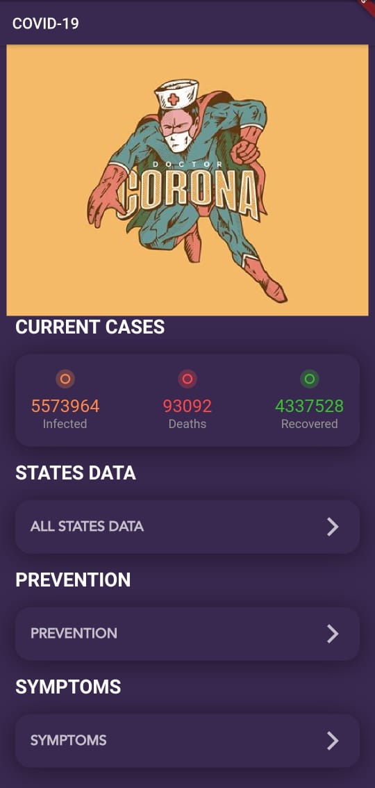
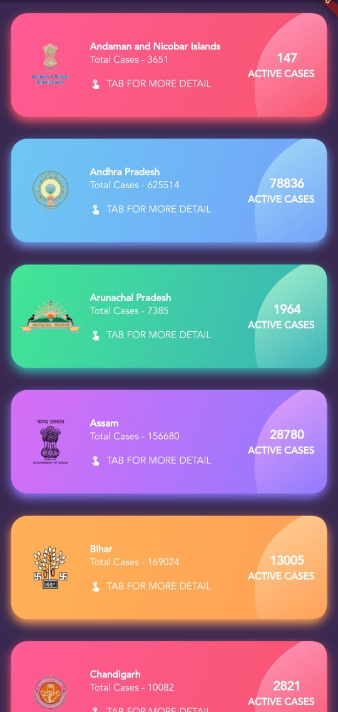
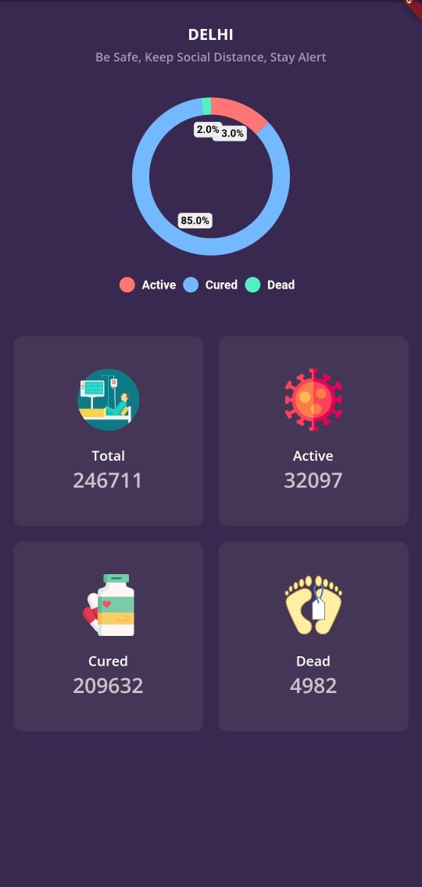
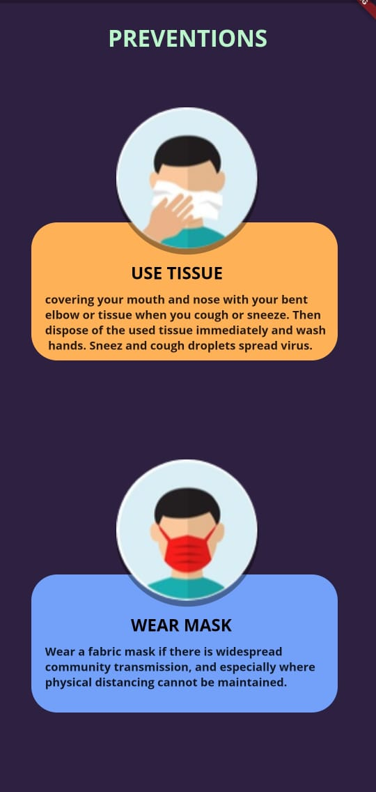
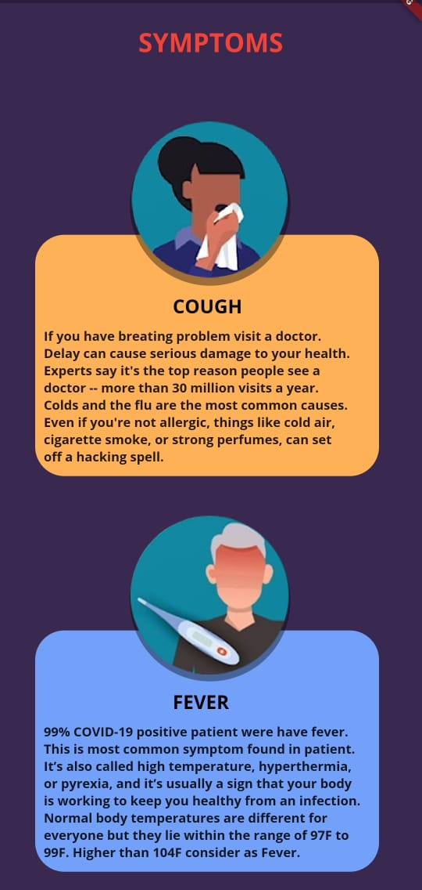

# Covid-19 Mobile-App
## Table of contents
* [General info](#general-info)
* [Technologies](#technologies)
* [Setup](#setup)
* [Project Demo](#project-demo)

## General info
This is a complete Android/IOS app to give information about total Covid-19 casses in india and in indian states.
	
## Technologies
Project is created with:
* Flutter
* Dart
	
## Setup
To use this projects assets and programmed files i request you to use pull request let. I have include only the lib and assets folder and pubspec.yml file so that you know which libraries i have used.

```
Please download the file and setup accordingly got to the Covid-19-Mobile-App directory and perform following task.
Before this you should have created a flutter project and setup all needs.
Copy the lib and aseets in your project here is the setup for linux(Ubuntu 18.04)
$ cp /lib/  /to/your/desired/folder/
$ cp /assets/ /to/your/desired/folder/
```
### Project Demo

## Download the app 
https://drive.google.com/file/d/1qjR6YSKsLx3lvOtC4mlA5mDbhAm0aGCu/view?usp=sharing

### Main Menu


### State List


### State Info


### Preventions


### Symptoms

